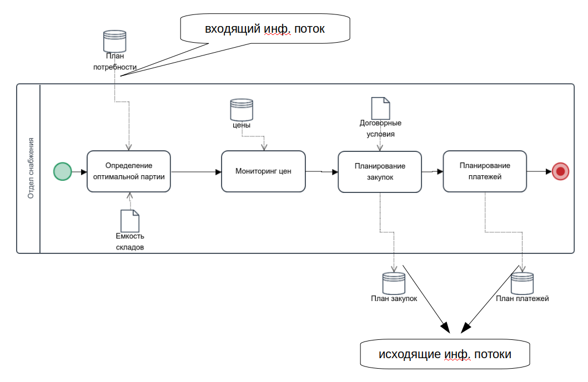
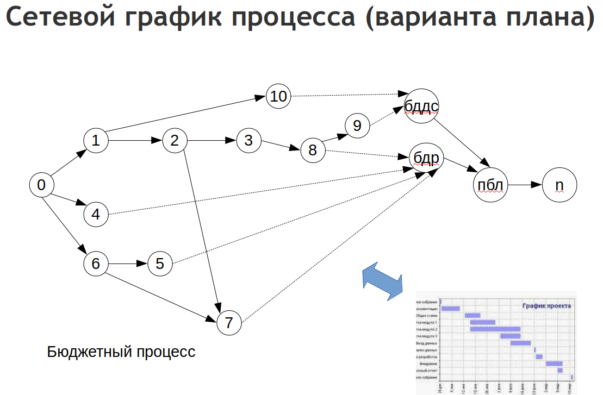
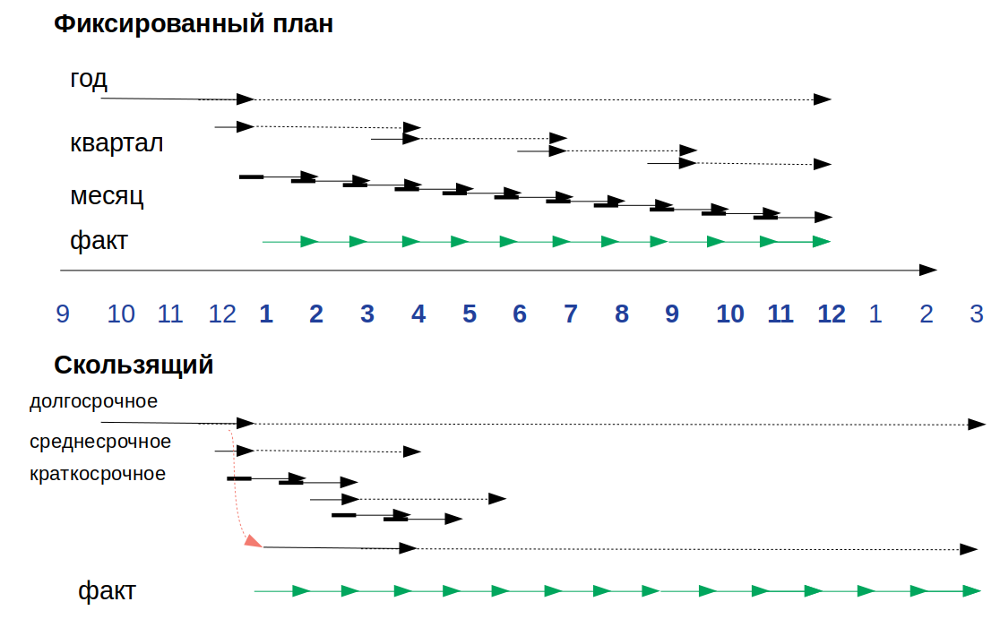

# MyBalance #

MyBalance - минимальный набор инструментов для создания форм заменяющих электронные таблицы в плановых отделах предприятий.
Предлагается базовый скелет позволяющих путем подключения модулей дополнять условные "книги" электронных таблиц дополнительными страницами с необходимым функционалом.
С другой стороны можно воспринимать MyBalance как специфичную DTS описываемую языком lsFusion.


## Структура ##

### Базовый скелет ###
Базовый скелет предлагает следующее:

1. Организация "Книги" с иерархическим видом списка листа расчетов (Настройки - Виды расчетов). Это своеобразный шаблон расчета.
2. Вид расчетов ("Книга") состоит из набора задач - листов. Состав книги задается при редактировании шаблона "Вида расчета". Реализуется каждая задача расчета с помощью модуля разрабатываемого на языке lsFusion. При добавлении задачи в список - определяется только ее название и позиция в иерархии.
3. Для работы с расчетами ("Книгами") предназначен журнал "Реестр расчетов". Для каждого нового разреза данных в реестре создается новый расчет на основе шаблона книги.
4. Для подключения к внешним системам создан справочник Настройки - Внаешние источники.
5. Для подключения функций внешних модулей к источникам - существует справочник Настройки - Процедуры и операции.

### Измерения ###

 Каждая задача (лист электронной таблицы), по сути, должна реализовывать какой либо один или несколько кубов данных.
В качестве обязательных базовых измерений при создании куба данных вводятся
1. task   'задача'
2. period 'Период'  
3. calc   'расчет'
  3.1 scenario 'Сценарий'
4. date  'дата записи'

при этом
 - calc и task являются позицией данных в пространстве программных объектов "Вид расчетов" и "Задача"
 - scenario, period, date это позиция данных в учетном пространстве

### Модули ###

Предполагается индивидуальная разработка модуля под каждый "аналог электронной таблицы"
Модуль состоит из следующих элементов
1. Куб данных

  1.1 Включающий обязательные измерения

  1.2 Включающий дополнительные измерения (справочники).

  1.3 Меры необходимые для реализации функционала.
2. Формы - отображение данных для пользователя и их редактирование.
3. Функции получения данных извне и/или из других кубов.
4. Функции трансформации данных внутри куба (расчетов).



Используя пример на рисунке:
1. Модуль может содержать 4 куба / закладки формы

  1.1 Список товаров с указанием номера партии

  1.2 Список цен

  1.3 План закупок

  1.4 План платежей (план закупок с указанием даты оплаты)

2. Форму создается с 4 закладками. В принципе в данном случае можно делать 4 раздельных модуля.
3. Функции получения данных формализуются для загрузки плана потребностей, для загрузки цен (или вводятся вручную)
4. Функции трансформации данных внутри куба - это расчеты таблиц планирования закупок, платежей.

### Расчеты ###



Модули включаются в Расчеты в виде задач расчета. Последовательность выполнения (заполнения форм) задач и их состав формируют цельный расчет.

### Сценарии ###


Создание в журнале расчетов набора расчетов, которые могут повторно выполнять расчет одного и того же периода организуют сценарность хранения данных. Это позволяет делать прозвольное количество вариантов расчетов.

 

Каждый вариант (сценарий) имеет независимые от других варианты расчетов. Так же расчеты независимы от предыдущих отчетов. Зависимости присутсвуют только при проведении расчета. Отсутствуют регистры накопления - наподобие складских остатков. Такие регистры и данные имеют смысл только для учета факта и могут быть получены (данные) импортом из учетной системы. При формировании планов в большинстве случаев даже складские остатки имеют предположительный расчетный вид и формируются независимо для каждого варианта расчета даже если они совпадают.

### Структура проекта ###

```
|-- lsfusion
    |-- myBalance
    |-- clent1Modules
        |--myBalance
        |--
    |-- clent2Modules
        |--myBalance
            |--dimens
            |--modules
                |--modul1Name
                  |--
                  |--
        |--
```
Разработка модулей клиента выполняется в отдельной папке конкретного клиента в которой создается папка myBalance.
Папка myBalance содержит папки
 - dimens - содержит модули объявляющие справочники (измерения)
 - modules - содержит папки модулей. Наименование папок произвольное. Папка модуля содержит произвольное количество модулей. Базово 3 файла модуль объявления куба, модуль объявления формы, модуль для описания функций.


## Пример добавления модуля ##
<->
### Добавление измерений ###
<->
### Добавление куба данных ###
<->
### Добавление формы и ее регистрация ###  
<->
### Добавление процедур обработки и импортов ###
<->

