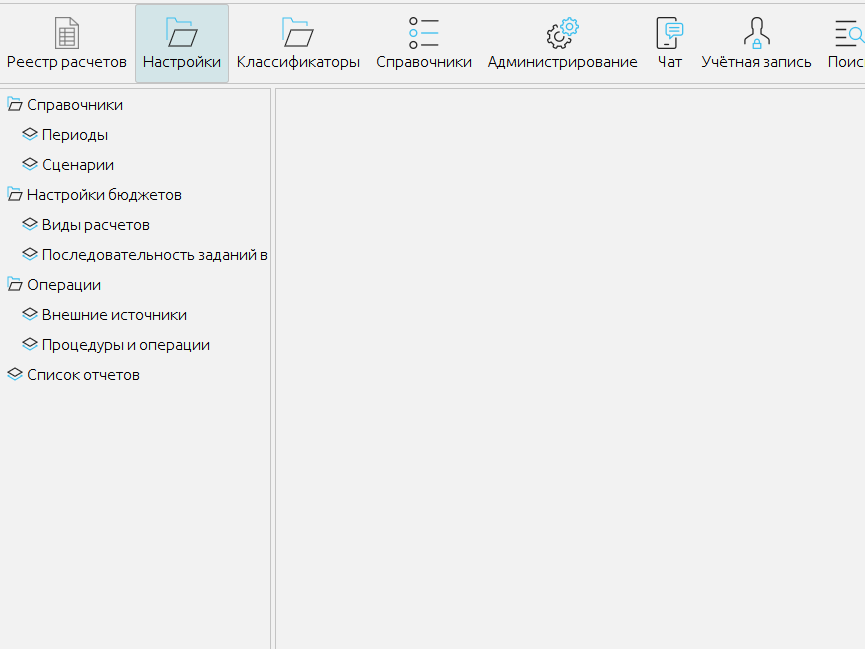
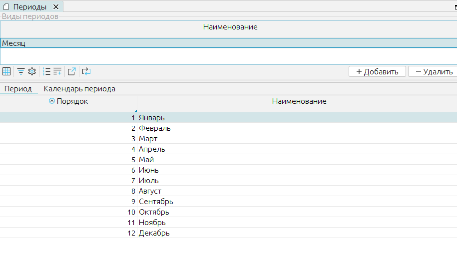
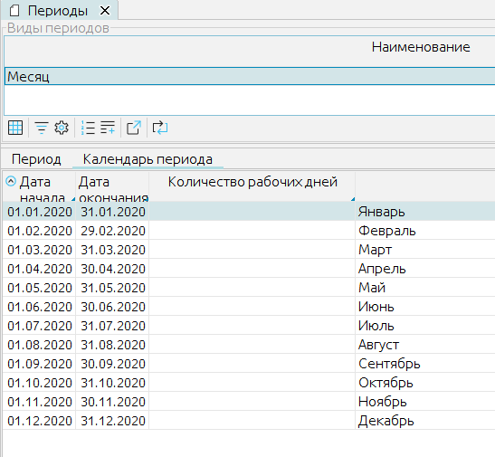
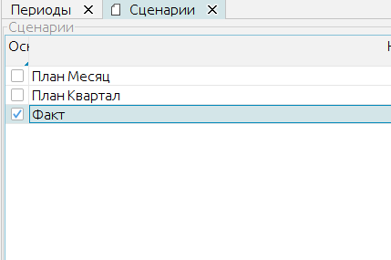
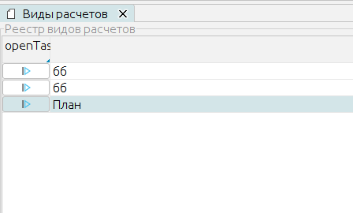
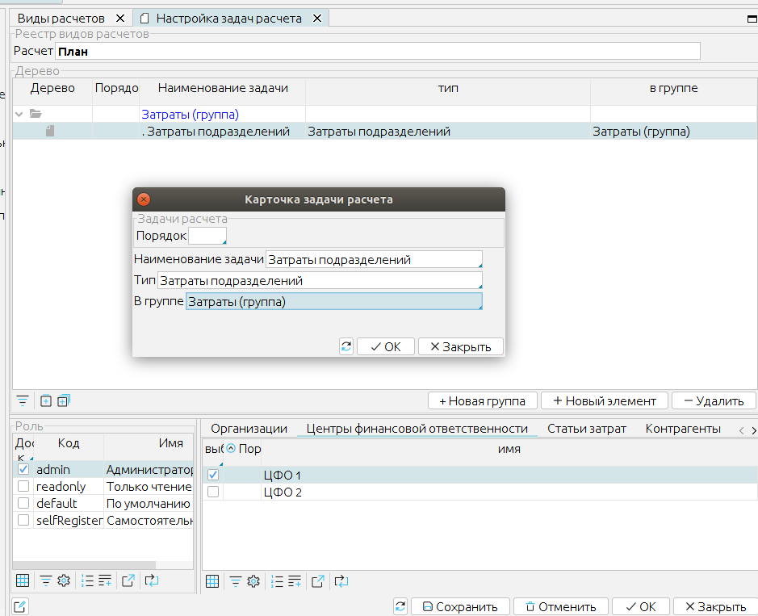
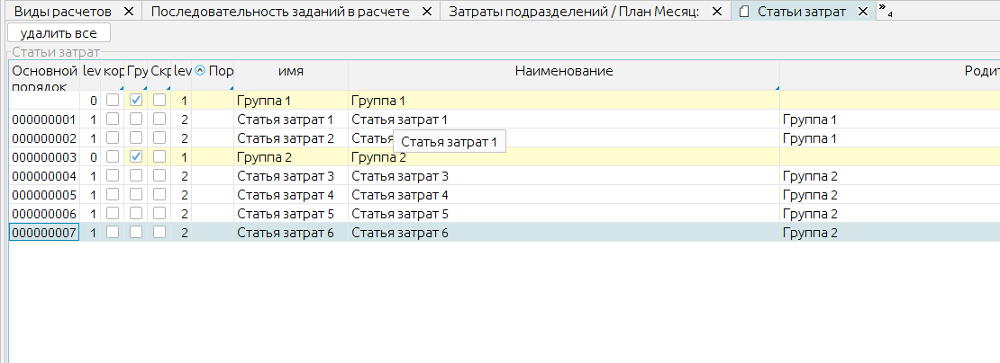
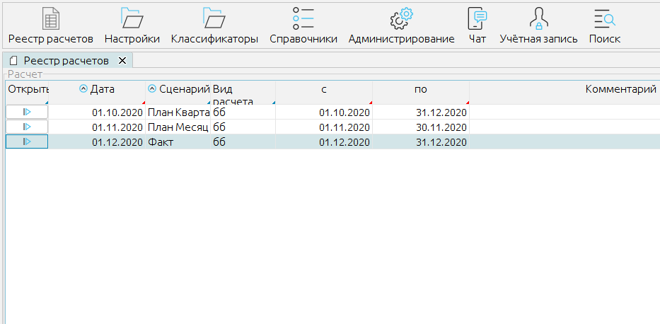
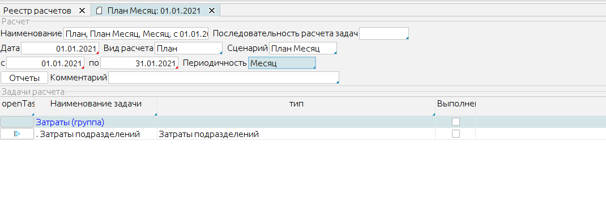
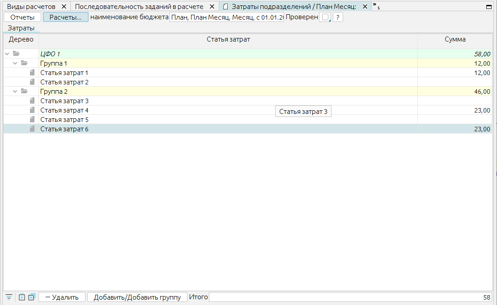

# MyBalance #

MyBalance - минимальный набор инструментов для создания форм заменяющих электронные таблицы в плановых отделах предприятий.
Предлагается базовый каркас позволяющих путем подключения модулей дополнять условные "книги" электронных таблиц дополнительными страницами с необходимым функционалом.
С другой стороны можно воспринимать MyBalance как специфичную DTS описываемую языком и на платформе [lsFusion](https://lsfusion.org/).


## Структура ##

### Базовый каркас ###
Базовый каркас предлагает следующее:

1. Организация "Книги" с иерархическим видом списка листа расчетов (Настройки - Виды расчетов). Это своеобразный шаблон расчета.
2. Вид расчетов ("Книга") состоит из набора задач - листов. Состав книги задается при редактировании шаблона "Вида расчета". Реализуется каждая задача расчета с помощью модуля разрабатываемого на языке lsFusion. При добавлении задачи в список - определяется только ее название и позиция в иерархии.
3. Для работы с расчетами ("Книгами") предназначен журнал "Реестр расчетов". Для каждого нового разреза данных в реестре создается новый расчет на основе шаблона книги.
4. Для подключения к внешним системам создан справочник Настройки - Внаешние источники.
5. Для подключения функций внешних модулей к источникам - существует справочник Настройки - Процедуры и операции.

### Измерения ###

 Каждая задача (лист электронной таблицы), по сути, должна реализовывать какой либо один или несколько кубов данных.
В качестве обязательных базовых измерений при создании куба данных вводятся
1. task   'задача'
2. period 'Период'  
3. calc   'расчет'
  3.1 scenario 'Сценарий'
4. date  'дата записи'

при этом
 - calc и task являются позицией данных в пространстве программных объектов "Вид расчетов" и "Задача"
 - scenario, period, date это позиция данных в учетном пространстве

### Модули ###

Предполагается индивидуальная разработка модуля под каждый "аналог электронной таблицы"
Модуль состоит из следующих элементов
1. Куб данных

  1.1 Включающий обязательные измерения

  1.2 Включающий дополнительные измерения (справочники).

  1.3 Меры необходимые для реализации функционала.
2. Формы - отображение данных для пользователя и их редактирование.
3. Функции получения данных извне и/или из других кубов.
4. Функции трансформации данных внутри куба (расчетов).


Используя пример на рисунке:
1. Модуль может содержать 4 куба / закладки формы

  1.1 Список товаров с указанием номера партии

  1.2 Список цен

  1.3 План закупок

  1.4 План платежей (план закупок с указанием даты оплаты)

2. Форму создается с 4 закладками. В принципе в данном случае можно делать 4 раздельных модуля.
3. Функции получения данных формализуются для загрузки плана потребностей, для загрузки цен (или вводятся вручную)
4. Функции трансформации данных внутри куба - это расчеты таблиц планирования закупок, платежей.

### Расчеты ###


Модули включаются в Расчеты в виде задач расчета. Последовательность выполнения (заполнения форм) задач и их состав формируют цельный расчет.

### Сценарии ###


Создание в журнале расчетов набора расчетов, которые могут повторно выполнять расчет одного и того же периода организуют сценарность хранения данных. Это позволяет делать прозвольное количество вариантов расчетов.

 

Каждый вариант (сценарий) имеет независимые от других варианты расчетов. Так же расчеты независимы от предыдущих отчетов. Зависимости присутсвуют только при проведении расчета. Отсутствуют регистры накопления - наподобие складских остатков. Такие регистры и данные имеют смысл только для учета факта и могут быть получены (данные) импортом из учетной системы. При формировании планов в большинстве случаев даже складские остатки имеют предположительный расчетный вид и формируются независимо для каждого варианта расчета даже если они совпадают.

### Структура проекта ###

```
|-- lsfusion
    |-- myBalance
    |-- clent1Modules
        |--myBalance
        |--
    |-- clent2Modules
        |--myBalance
            |--dimens
            |--modules
                |--modul1Name
                  |--
                  |--
        |--
```
Разработка модулей клиента выполняется в отдельной папке конкретного клиента в которой создается папка myBalance.
Папка myBalance содержит папки
 - dimens - содержит модули объявляющие справочники (измерения)
 - modules - содержит папки модулей. Наименование папок произвольное. Папка модуля содержит произвольное количество модулей. Базово 3 файла модуль объявления куба, модуль объявления формы, модуль для описания функций.


## Пример добавления модуля ##
Модуль будет представлять собой 2 мерную таблицу содержащий затраты подразделений по статьям затрат.
Измерения: Подразделение, Статья затрат
Мера: Сумма затрат

Добавим следующую структуру каталогов в проект
```
|-- lsfusion
    |-- client1
        |--myBalans
            |--dimens
            |--modules
              |--cost
                |--ActionKhpCost.lsf
                |--CubeKhpCost.lsf
                |--FormKhpCost.lsf
```
Реализация бюджетной таблицы будет выполнятся в отдельном каталоге клиента.
`lsfusion/client1/modules/cost/`

### Добавление измерений ###

Специфические подразделения для реализации в конкретной таблице предполагается добавлять в папке конкретной реализации
`lsfusion/client1/dimens`
но в данном случае эти два измерения объявлены как базовые в ядре

`/lsfusion/myBalans/dimens/DimensCostItems.lsf` Статьи затрат
`/lsfusion/myBalans/dimens/DimensCFO.lsf` Подразделения

в модуле DimensCostItems.lsf прокомментирован текст объявления справочника Статьи затрат

### Добавление куба данных ###
Куб данных объявим в модуле `CubeKhpCost.lsf`

Комментарии в модуле

### Добавление формы и ее регистрация ###  
Форму объявим в модуле `FormKhpCost.lsf`

Основноф фокус подключаемой формы в следующем
1. Форма объявляется как уникальный идентификатор в классе `TypeTask`
```
// зарегистрируем форму как новый тип форм
EXTEND  CLASS TypeTask{
     KhpCost 'Затраты подразделений'
}
```
2. Имя формы фиксируется как префикс  form + идентификатор
```
FORM  formKhpCost 'Затраты подразделений';
```
3. После этого вызывается конструктор шапки с параметром - имя формы без префикса и именем класса
```
@createFormReqPropertysBeforeOBJ(khpCost, CubeKhpCost)
```

4. Далее форма заполняется так, как необходимо логике работы вашей таблицы
в том числе накладываются фильтры из настроек - если они вам нужны (checkedCostItems - см. в модуле DimensCostItems.lsf)


### Добавление процедур обработки и импортов ###


#### Для вызова внутренних функций, например расчета или копирования таблицы ####

используется МЕТА код
`@createLocalMenuOperation(CubeKhpCost,formKhpCost)`

далее в файле `ActionKhpCost.lsf`
показана реализация метода копирования.
по аналогии можно расширять класс созданный в метакоде для добавления пунктов меню

#### Для вызова внешних функции используется вторая кнопка ####
ее отличие - внешние функции подключаются в форму из справочника функции
потому, что к функциям внешним кроме алгоритма надо привязать источник данных

<пример не описан>


## Пример настройки и использования модуля ##

### Предварительная настройка ###


#### Периоды ####

Обьявите тип периода, заполните его состав и привяжите к датам в календаре периода



#### Сценарии ####

Заведите имена необходимых сценариев



#### Виды расчетов ####

Вид расчета играет роль книги электронной таблицы.



Внутри расчета будем создавать иерархию таблиц. Нажав кнопку выполнить левее названия вида расчета откроется структура расчета.



- Создадим группу затраты
- создадим таблицу (бюджет) "Затраты подразделений". Включим ее в группу затраты. И самое главное выберем тип "Затраты подразделений" - это то самое значение класса TypeTask при объявлении формы в коде.
- отметим галочкой какой группе прав оно будет доступно при открытии Книги
- если необходимо сделать только по конкретным подразделениям - то отметим подразделение. Для другого подразделения можно содать еще один лист (бюджет) в этой же иерархии, но можно с другими правами просмотра.

Для начала работы достаточно.


### Использование бюджетов ###

#### Использование бюджетов ####

Заполните справочники Статьи затрат и подразделений
Главное меню - классификаторы.

Внимание: для Бюджета затрат подразделений в реализации примера статьи затрат должны быть в группах




#### Использование бюджетов ####

1. Для работы с книгами открываем реестр расчетов из главного меню



2. Создаем новый расчет (Книгу)



- Заполнив все поля - появится настроенная структура листов.
- Сохраните книгу.
- Можно открывать таблицу и заполнять данные



 3. На листе по кнопке `Расчеты...` можно вызвать нашу процедуру копирования данных из другой книги.
